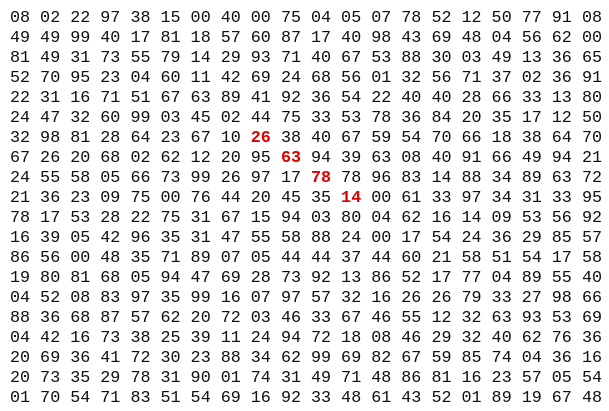

# Problem
In the 20×20 grid below, four numbers along a diagonal line have been marked in red.

The product of these numbers is 26 × 63 × 78 × 14 = 1788696.

What is the greatest product of four adjacent numbers in the same direction (up, down, left, right, or diagonally) in the 20×20 grid?

Link: [https://projecteuler.net/problem=11](https://projecteuler.net/problem=11)