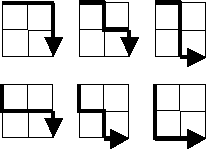

# Problem
Starting in the top left corner of a 2×2 grid, and only being able to move to the right and down, there are exactly 6 routes to the bottom right corner.

How many such routes are there through a 20×20 grid?

Link: [https://projecteuler.net/problem=15](https://projecteuler.net/problem=15)